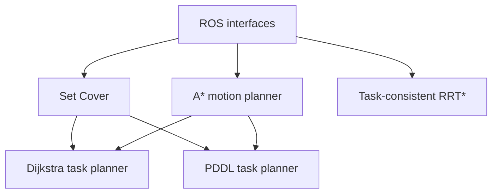

# ROS 2 Mobile Manipulator Planner

A ROS 2 planning framework for mobile-manipulator base placement and task execution.

The project separates two planning problems:

1. **Task-consistent RRT\*** for continuous tasks with a prescribed execution order.
2. **Unordered-task planning** with three interchangeable strategies:
   - Set Cover for selecting a compact set of feasible base poses
   - Dijkstra search for cost-aware task sequencing
   - PDDL for symbolic task planning

A shared grid-based A* planner provides obstacle-aware motion costs and paths between base poses.

> Status: active development. Thesis-specific datasets and documents are intentionally excluded.

## Target environment

- Ubuntu 22.04
- ROS 2 Humble
- C++17
- Python 3

## Packages

| Package | Purpose |
|---|---|
| `planner_interfaces` | Shared ROS messages and services |
| `unordered_task_planner` | Exact Set Cover now; Dijkstra and PDDL planned |
| `grid_motion_planner` | 8-connected, obstacle-aware grid A* |
| `planner_bringup` | Synthetic scenario, launch files and RViz configuration |
| `task_consistent_rrt_star` | Continuous ordered-task planning (planned) |

## Architecture



## Build

```bash
mkdir -p ~/planner_ws/src
cd ~/planner_ws/src
git clone https://github.com/mL-9498/ros2-mobile-manipulator-planner.git
cd ..
source /opt/ros/humble/setup.bash
rosdep install --from-paths src --ignore-src -r -y
colcon build --symlink-install
source install/setup.bash
```

## Run the synthetic RViz demo

```bash
ros2 launch planner_bringup planners.launch.py
```

The demo uses only generated data:

- red spheres: unordered task points
- blue cubes: candidate mobile-base poses
- green cubes: minimum-cardinality poses selected by Set Cover
- gray cells: occupied grid cells
- orange line: collision-free A* path between selected poses

Console output reports the selected base IDs, path pose count and path length.

## Implemented behavior

- Exact minimum-cardinality Set Cover with branch-and-bound pruning
- ROS 2 service interfaces for coverage selection and grid path planning
- 8-connected A* with diagonal corner-cut prevention
- Synthetic occupancy grid and task/base-pose scenario
- RViz map, marker and path visualization
- GitHub Actions build and test on ROS 2 Humble

## Roadmap

- [x] Define repository architecture
- [x] Add common ROS 2 interfaces
- [x] Add exact Set Cover node
- [x] Add grid-based A* node
- [x] Add a synthetic RViz demonstration
- [ ] Add Dijkstra state-space planning
- [ ] Add PDDL problem generation and plan parsing
- [ ] Refactor Task-consistent RRT* into a ROS 2 node
- [ ] Add algorithm-level unit and integration tests

## Data policy

This public repository contains only reusable examples and synthetic demonstration data. Original thesis documents, experiment outputs, inverse-reachability datasets and institution-specific assets are not included.
