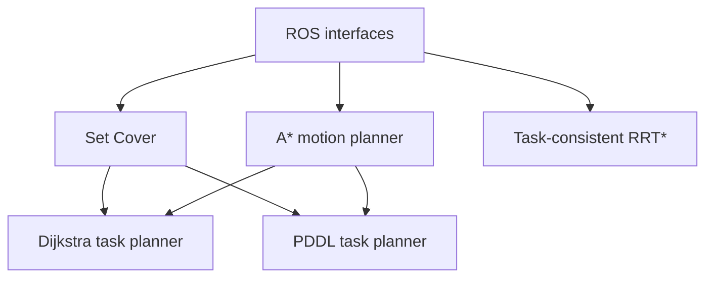

# ROS 2 Mobile Manipulator Planner

A ROS 2 planning framework for mobile-manipulator base placement and task execution.

The project separates two planning problems:

1. **Task-consistent RRT\*** for continuous tasks with a prescribed execution order.
2. **Unordered-task planning** with three interchangeable strategies:
   - Set Cover for selecting a compact set of feasible base poses
   - Dijkstra search for cost-aware task sequencing
   - PDDL for symbolic task planning

A shared grid-based A* planner provides obstacle-aware motion costs and paths between base poses.

> Status: early development. The repository is being refactored from research prototypes into reusable ROS 2 packages. Thesis-specific datasets and documents are intentionally excluded.

## Target environment

- Ubuntu 22.04
- ROS 2 Humble
- C++17
- Python 3

## Planned packages

| Package | Purpose |
|---|---|
| `planner_interfaces` | Shared ROS messages and services |
| `planner_core` | Common geometry, task and planning data structures |
| `unordered_task_planner` | Set Cover, Dijkstra and PDDL strategies |
| `grid_motion_planner` | Grid-based A* path planning |
| `task_consistent_rrt_star` | Continuous ordered-task planning in base pose/task-progress space |
| `planner_bringup` | Launch files, parameters and demonstrations |

## Architecture



## Build

```bash
mkdir -p ~/planner_ws/src
cd ~/planner_ws/src
git clone https://github.com/mL-9498/ros2-mobile-manipulator-planner.git
cd ..
source /opt/ros/humble/setup.bash
rosdep install --from-paths src --ignore-src -r -y
colcon build --symlink-install
```

## Roadmap

- [x] Define repository architecture
- [ ] Add common ROS 2 interfaces
- [ ] Add a minimal Set Cover node
- [ ] Add a grid-based A* node
- [ ] Add Dijkstra state-space planning
- [ ] Add PDDL problem generation and plan parsing
- [ ] Refactor Task-consistent RRT* into a ROS 2 node
- [ ] Add RViz demonstrations and automated tests

## Data policy

This public repository contains only reusable examples and synthetic demonstration data. Original thesis documents, experiment outputs, inverse-reachability datasets and institution-specific assets are not included.
